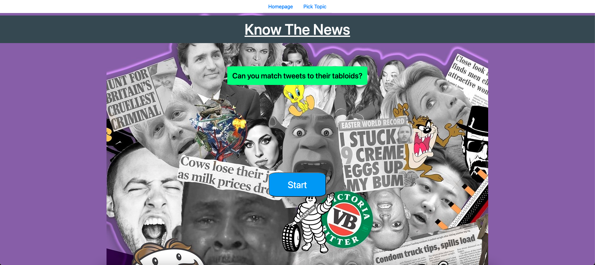
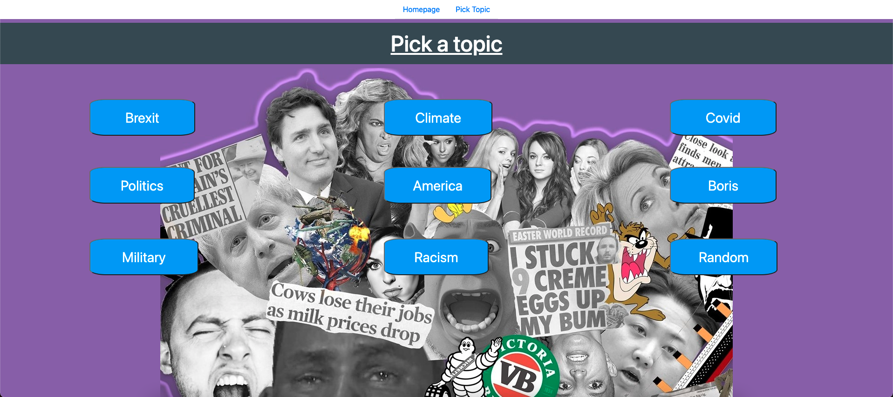
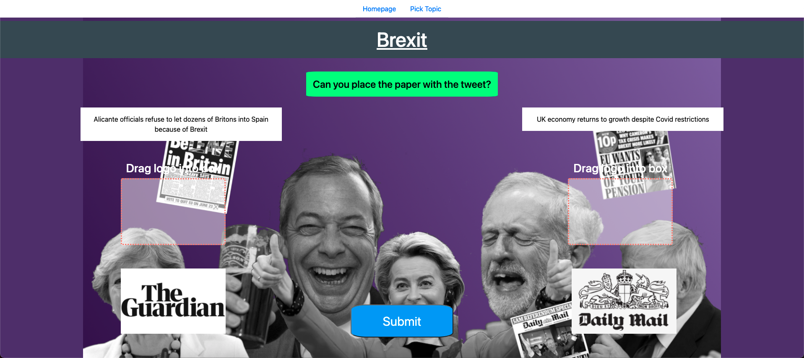
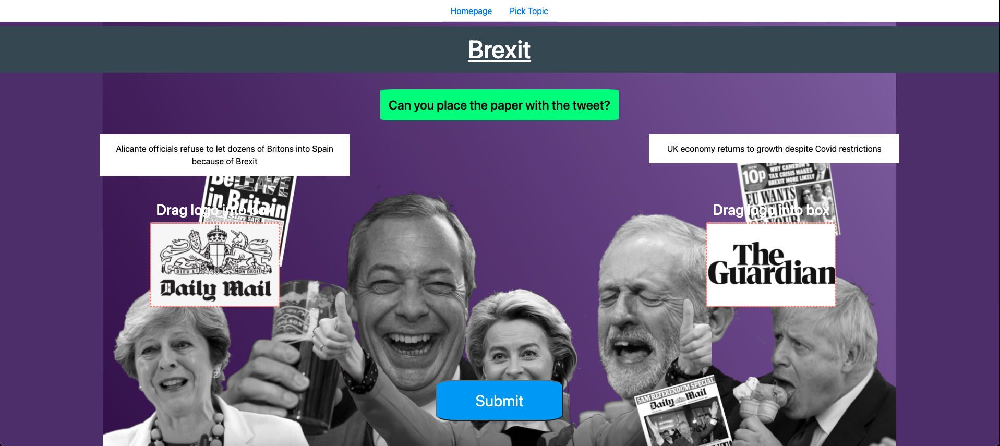
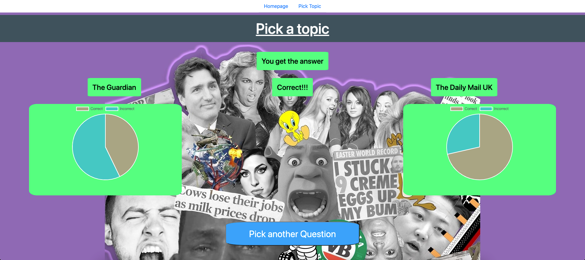

# Know The News

## Group Members
 Name | Role | Picture 
---|---|---
 Phillip Sloan | User research and prototyping |   
Joseph Hedin | Front-end development |  
Daniel Chow | Back-end development |  
Harry Field | User-Experience and background research |  
James Wilson | Team Management and front-end development |  

### 1. Introduction
### 2. [Background & Motivation](Background_and_Motivation/Readme.md)
### 3. [System Implementation](System_Implementation/README.md)
### 4. [UX Design](UX_Design/README.md)
### 5. [Sprints & Project Management](Sprints_&_Project_Management/README.md)
### 6. Evaluation
### 7. Conclusion

# Introduction
_Know the News_ is a single page web app built to raise awareness of one’s own bias towards the media. As our consumption of media content becomes ever more automated with evolving technologies, one might understandably stereotype media outlets as presenting a consistent, politically biased opinion [1][2].

### Serious Play
Our application hopes to show people how well they really know the voice of newspapers by presenting an interactive quiz-style game. The game involves tasking users with assigning tweets on a chosen topic to their corresponding newspaper and then evaluating the results. Through this process, the user is confronted with an accurate representation of how well they can detect a newspaper's voice (or rather, how well they _Know the News!_). If the user feels they were given a particularly easy/tough question, they can simply keep trying repeatedly as the questions are _randomly_ generated every time from an automatically updated set of tweets. Because of this, users can keep coming back again and again over long periods of time, always finding new questions to be tested with.

### How it works
The user selects from a list of pre-defined categories believed to be politically divisive, after which the user is taken to the quiz page. The quiz page displays random tweets on the selected topic from a database which regularly updates through contacting the Twitter API. The tweets are displayed on screen, and users must click-and-drag them to the correct newspaper logo they belong to. After this the user is presented with their personal result as well as the overall results of all people who have been asked questions on the same newspapers.

 
More detail

 1. The user arrives at the site and is greeted by the message "Can you match the tweets with their tabloids?", explaining the purpose of the quiz. The user clicks the "Start" button. Using the Angular framework for front end development, all pages are represented by different components loaded in as and when required.
 
 

 2. The topic page component is loaded, displaying an array of buttons representing topics to choose from. In this example, the user clicks the "Brexit" button which loads the subject module.

 

 3. The subject page component is loaded. This page represents the core feature of Know The News, where the user is assessed on their ability to match the tweets with their corresponding tabloids. The tweets are represented by two text boxes on either side of the screen containing tweets randomly pulled from our MongoDB database. The database is updated regularly through contacting the twitter API in order to consistently provide new questions. The tweets are passed into the front end along with their corresponding newspaper images, which are placed at either side of the bottom of the screen. The user must click and drag the newspaper logos into the correct boxes and click "Submit" to confirm their choices.

Before choices:

 

After choices:

 

4. Once the user has submitted their answers, the results module is loaded. This module informs the user if their answer to the question was correct, as well as provide information on how well users have done overall in accurately assigning tweets with the newspapers the user has just been exposed to. This is achieved by:

- Sending the users answer to the back-end, and checking for a correct match.
- Querying the back-end database for overall statistics on what number of people have answered correctly for the newpapers just used.
- Loading a pie-chart module to display the data.

No personally identifiable user data is stored in our database, only that "someone" got the answer right or wrong with regards to the newspapers currently being queried.

 

 

### Project Objectives:
1.	Design and build a functioning single page web application with quiz game functionality
2.	Populate database using Twitter API
3.	Present information back to the user on how accurately they Know the News
4.	Demonstrate that this application can be used to highlight one’s awareness of their own bias towards the media

## Project Structure
 - angular - contains the code for our app
 - JIRA screenshots - screenshots of our JIRA board
 - Data Model - how we envisage our Data schema and data model
 - Twitter API - contains the script we intend to use to retrieve headlines from twitter
 - Ideas - Contains all ideas that for the Serious Play app which we have considered.
 - Meet notes - contains minutes from our meetings
 
# Acknowledgements
Special thanks to all the lecturers on the Software Engineering unit at University of Bristol 2021 for all their help and support. 

# References
    1. Antunovic, D. Parsons, P. Cooke, TR. (2018) ‘’Checking’ and googling: Stages of news consumption among young adults’, Sage, 19(5) 632-648,  Page 635
    2. Lee, T. (2019), ‘The global rise of “fake news” and the threat to democratic elections in the USA’, Public Administration and Policy: An Asia-Pacidfic Journal, 2517-679X, Page 17.
 
