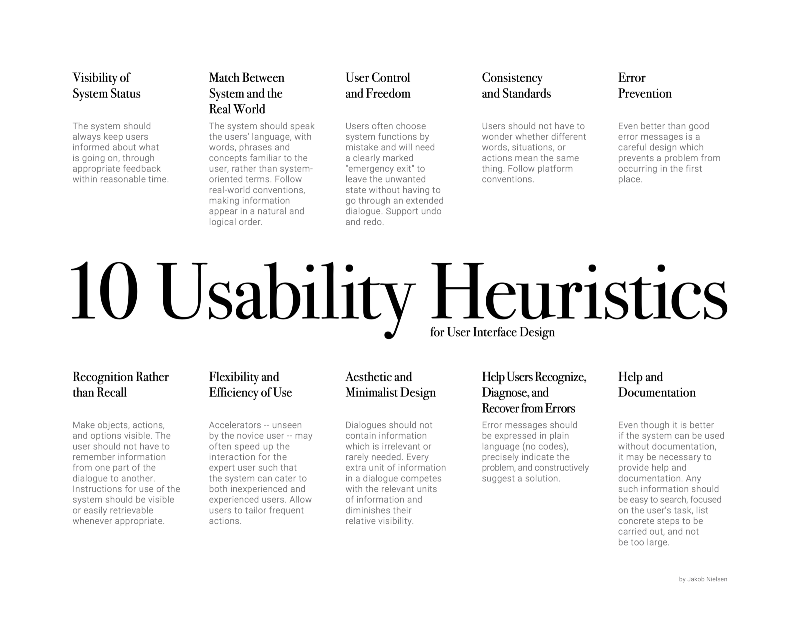

# Frontend Write Up

We used the Angular framework for developing the frontend of our application.

Our application is divided into multiple components, with each one rendering it's own 'view', or page. Our component hierarchy is set out below. Please click on each link for a full description of each component's implementation.

* [Homepage](#homepage-component)
* [Topics Page](#topic-page-component)
  * [Subject Components](#subject-components)
* [Results Page](#results-page-component)
* [404 Page component](#404-page-component)
    

### Routing
To set up the routing of our components, we used the lazy loading feature of Angular, to ensure that child pages of the Topics page were only loaded when the user clicks on the Topics page link.

This involved a separate topics routing module, topicpage-routing.module.ts, which defined the child routes, and used the forChild() method of routing as follows:

```angular2html
@NgModule({
    imports: [
      RouterModule.forChild(topicRoutes)
    ],
    exports: [
      RouterModule
    ]
  })
```

In the higher-level app-routing.module.ts file, we then lazily load the Topic Child pages:

```angular2html
{
    path: 'topicpage',
    loadChildren: () => import('./topicpage/topicpage.module').then(m => m.TopicPageModule)
  }
```

## Navigation Bar ##
Present on each of our pages is the navigation bar at the top of the screen. This allows easy access to the homepage and the Topics page, and is implemented in the app.component.html file.


## Homepage component

The homepage is simple but showcases the playful theme of the website and gives users an introduction to its purpose. During user testing of the higher fidelity prototype, we received feedback that users were confused about what the app was actually for. To address this, on this page a text banner was added to give an explanation about the website and a large-animated start button was added making it easy for people to know where to click to advance.

The start button was animated using CSS which causes the colour to change as well as changing the text displayed on the button This is achieved using 'hover' and 'after' selectors.

## Topic page component

The topic page displays a number of buttons listing the available topics, each one rerouting the user to the selected page with questions particular to that topic. When the 'random' button is clicked, rather than rerouting to another page, the "randomTopic()" function (defined in topicpage.component.ts) is called. This function uses a random number generator to decide which topic the user will be routed to.

We created a separate module file for the topics page component, containing the imports of each our of subject pages which the topic page routes to. This allowed us to load the subcomponents via the topics module rather than importing every class into the main app.module file.

## Subject components

Each subject page shows two separate tweets, two empty boxes and the logo for two popular newspapers. The task of the user is to read the tweets and try and guess which tweet matches which newspaper and to then drag and drop the respected newspapers logo into the drop boxes.

### Data Injection
In order to retrieve newspaper data from our API, we created a DataService class which is injected into each topic page component as follows:

```angular2html
 constructor(private dataService: DataService, private router: Router) { }
```
When each topic page is initialised (via 'ngOnInit()')the “receiveData()” function is called, which sends a call to our API through the data service and retrieves two papers at random along with a headline for each.

This data injection also allows us to perform logic in the Front End and thus minimise calls to the BackEnd. When the user matches the newspapers to the tweets and clicks 'submit', a function is called in component.ts which determines if the answer was correct or not, based on the data already loaded in from the DataService. The result of the user's guess is then set in the DataService, ready to be used in the Results Page.


### Drag and Drop Functionality ###
The drag and drop functionality used for the newspaper logos was implemented in all subject components using Angular's cdk drag-drop module.

We found this implementation to be challenging. This was because CdkDragDrop is mostly used for creating lists but for our implementation, we only wanted a single logo to be dropped into our containers. Consequently, we implemented a predicate function in each subject's component.ts file, which returned a boolean value depending on if the list (container) was empty or not, and hence if the object may be dropped.

### Newspaper Logos ###

Another challenge faced whilst implementing the Subject pages was loading in the correct newspaper logos for the users to drag and drop. 

To do this, we needed to set the values of the CDKDragDrop array to the URLs of the images relating to the names of the newspapers which the API call returned.  However, because the API took some time to return the paper names, the URLs were not being set before the page loaded and consequently the newspaper logos were not appearing.

To resolve this issue, in the html file we set the src attribute of the image to a getter function which returns the correct url path to the image, where previously we had hard-coded it to a variable containing the paper's name. This function call approach works because by the time the function is called, the API has returned the paper names and so there is a URL to pull the image.
```angular2html
 <div *ngFor="let item of paperbox1" cdkDrag>
   
 </div>
```
```angular2html
  getimagepb1(){
    if(this.paperbox1[0] == "PAPER1"){
      return this.paper_url1;
    }
    return this.paper_url2;
  }
  ```

### Design Heuristics ###

We applied Nielsen’s design heuristics throughout our front end code. Of particular note is our approach to Error Prevention.  

Whilst testing our code, we realised that users could click “Submit” before matching both tweets up. We implemented a function whereby, if this scenario occurred, a pop-up containing an error message appeared, “Make sure you have filled both drop boxes”.



## Results page component

Upon initilisation of the Results Page, the result from the last question are obtained from the date service as well as the names of the papers which were used for the last question. A message is returned to the user informing them of the result.

The names of the correct and incorrect paper are returned to the API to update the database, where we collect data on the number of right and wrong answers per newspaper. The overall scores for the relevant newspapers are then returned to the front end, where we display the data using two pie charts.

### Use of chartsJS

The charts are from the charts.JS module which makes it incredibly easy to create and modify graphs. Using Angular's data binding features, the chart data is specified in the module.ts file, and bound in the html file as follows:

```angular2html
<div class = chart1 style="display: block">
      <canvas baseChart
              [data]="pieChartData1"
              [labels]="pieChartLabels1"
              [chartType]="pieChartType1">
      </canvas>
  </div>
```

## 404 page component
This component is a very simple page showing the error message 404 to let the user know that they have entered an invalid URL. This is picked up by the wildcard path located in the app-routing module.

## Current bugs and known issues

There are currently three known issues with the site which had not been fixed due to the fact that they are not “game breaking” and seeing that this is an MVP the time and effort which would be spent fixing them would be more valuable spent elsewhere.

The first of these minor issues occurs when a user has reached the results page and then refreshes the site. When they do this the paper names and statistics are all reset meaning that the paper names are no longer displayed in the graphs show their default statistics which were originally only meant as placeholders.

The second is that the function which is supposed to be updating the correct and incorrect for each paper and doesn't seem to be working meaning that the pie charts consistently show the same numbers even after a player has played through multiple times.

The last is less of an error and more an inconvenience but occurs when the user has dragged the two logos into place. Once this is happened, they cannot be swapped meaning that the user has to submit what they have already inputted. If only one dropbox has been filled the user can still drag the paper logos from the field empty box to the empty empty box.

