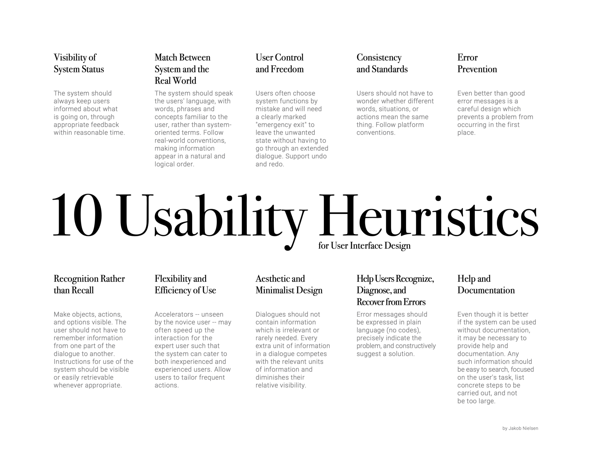

# System Implementation #
## Contents ##

1. [Stack Architecture and System Design](#stack-architecture-and-system-design)
2. [Back End and Middle Tier](#back-end)
3. [Front End](#front-end)
4. [Additional Elements](#additional-elements)
5. [Deployment](#deployment)


# Stack Architecture and System Design #

We used the MEAN stack architecture for our Project - MongoDB, Express, Angular and NodeJS.

Our system was designed by the front-end and back-end teams, with significant input from Phillip from a UX perspective to ensure that it reflected the needs of our end users. Our design was derived from user moderated testing that Phillip did with our wireframe design of the website.  As this design was decided before most of the implementation had begun, we made sure that the frontend and backend teams had the same vision of the end product which prevented friction when integrating. The system design is showed in the model below.

<p align="center">
 
</p>

The system architecture for our project was based on the model view controller design pattern. The front end acted as our view, the database is the model and our middle tier acts as the controller in conjunction with the RESTful API.

<p align="center">
 
</p>


# Back End #


For the backend and middle tier part of our project we used the predefined system design to set clear tasks, then from these tasks we set out a list of objectives. These objectives were:

1) Creating a dataset of tweets from major news sources


2) Provide the frontend with a supply of tweets from random newspapers


3) Track the performance of players in the quiz


4) Provide the frontend with information on how players perform, with the ability to group the performance data by newspaper.


### Creating the Data Source ###

To achieve our first objective we needed tweets from different newspapers' twitter feeds as they often post headlines as tweets. To do this, we created a python script that connected to the twitter api and retrieved tweets regarding certain topics (this can be found [here](https://github.com/jamesrw94/UoB_group_project/blob/dans_branch/twitterapi/twitterconnect.py)). We used pandas to clean this data and transform it into an easily digestible format. Once we had the script working we connected this script to a cron job that ran the script every week for 4 weeks - in this way we worked around the twitter api limitations for scraping new tweets. After collecting enough tweets we then collated them into one pandas dataframe, visualised this data (visualisations can be found [here](https://github.com/jamesrw94/UoB_group_project/blob/dans_branch/twitterapi/csv_contents_visualizations.ipynb)) and then turned the data into a json file ready for insertion into the mongodb server. Visualising the data allowed us to ensure that all combinations of newspapers were accounted for.
- To insert the data into the server, we used a bash script found [here](https://github.com/jamesrw94/UoB_group_project/blob/main/angular/insertion_script.sh) that reads in a .env file and uses that to authenticate a mongo exec command; inserting the json file directly into the database and creating the collection if it did not already exist. We decided reading in the .env file was the best option as this prevented us from having to put any passwords on our public github whilst also creating an easy way of inserting the needed information. However, this does not get over the problem of the data disappearing from the container when initialising the container on another computer. In the future we would like to deploy the mongo db container on a web server so that data is not lost when the server is moved to a different computer.


-Below is both of our data schemas.


# Middle Tier #

### Our RESTFul API ###
We used Express and Node in our Middle Tier. We implemented an api in the file [api.js](../angular/server/routes/api.js) and imported express to use the router functionality as follows:

```angular2html
const express = require('express');
const router = express.Router();
```
We could then use the router constant to perform functionality when the relevant route was called in the front end:

```angular2html
router.get('/brexit', (req, res) => {
  res.header("Content-Type",'application/json');
  get_both_random("Brexit",res);
});
```
We also create a number of bespoke functions in the api.js to retrieve and store relevant data, such as get_both_random(), as used in the code snippet above, and which returns two random tweets.


### Connecting to the Database ###

To achieve our second backend objective (providing the front end with randomised tweets) we needed two tweets to be called from our database to appear at the same time. Initially, we were having problems coordinating two callbacks to arrive at the front end at the same time as we needed each of the api calls to be for different newspapers. We solved this problem by using a Promise which allowed us to make separate calls to mongoose in the backend but package them up into a list for the frontend before sending back the request. This function can be seen below.

```
async function get_both_random(topic,res){
    var p = await get_random_papers();

    Promise.all([
        Tweets.aggregate([{$match:{"paper":p[0],"term":topic}},{$sample:{size:1}}]).exec(),
        Tweets.aggregate([{$match:{"paper":p[1],"term":topic}},{$sample:{size:1}}]).exec()
    ]).then(function(result) {
      res.send([].concat.apply([],result));
  })

}

```

### Updating the Database ###

For our third objective we needed to update our database to reflect when players got a question right or wrong. When updating the correct/incorrect newspapers, it did not make sense to create different api routes for each of the newspaper and correct/incorrect combination. Instead, we used two routes and used the HttpParams module to insert the newspaper into request. This allows for the code to be much more scalable and flexible. Below we have included the function that facillitates this flexibility.

```
public update_paper_correct(newspaper: string){
    let params = new HttpParams();
    params = params.append('paper', newspaper);
    return this.httpClient.get(this.REST_API_SERVER_UPDATE_CORRECT,{params: params});
}
```

### Provide meaningful results data ###
Finally for our fourth objective we needed to be able to retrieve news data. By this we mean how past players have answered the questions in the quiz. The way we achieved this was very similar to the method updating the database above using HttpParams to limit the amount of routes we needed to implement.


# Front End #

We used the Angular framework for developing the frontend of our application.

Our Front End report is dividided into the following sections:

1. [Routing](#routing)
2. [Navigation Bar](#navigation-bar)
3. [HomePage component](#homepage-component)
4. [Topic page component](#topic-page-component)
5. [Subject components](#subject-components)
   * [Data Injection](#data-injection)
   * [Drag & Drop](#drag-and-drop-functionality)
   * [Newspaper logos](#newspaper-logos)
   * [Design heuristics](#design-heuristics)
6. [Results Page component](#results-page-component)
   * [Use of chartsJS](#use-of-chartsjs)
7. [404 component](#404-page-component)
8. [Current bugs and known issues](#current-bugs-and-known-issues)

Our application is divided into multiple components, with each one rendering its own 'view', or page. Our component hierarchy is set out below.

* HomePage
* Topics Page
    * Subject Components
* Results Page
* 404 Page


## Routing ##
To set up the routing of our components, we used the lazy loading feature of Angular, to ensure that child pages of the Topics page were only loaded when the user clicks on the Topics page link.

This involved a separate topics routing module, topicpage-routing.module.ts, which defined the child routes, and used the forChild() method of routing as follows:

```angular2html
@NgModule({
    imports: [
      RouterModule.forChild(topicRoutes)
    ],
    exports: [
      RouterModule
    ]
  })
```

In the higher-level app-routing.module.ts file, we then lazily load the Topic Child pages:

```angular2html
{
    path: 'topicpage',
    loadChildren: () => import('./topicpage/topicpage.module').then(m => m.TopicPageModule)
  }
```

## Navigation Bar ##
Present on each of our pages is the navigation bar at the top of the screen. This allows easy access to the homepage and the Topics page, and is implemented in the app.component.html file.


## Homepage component ##

The homepage is simple but showcases the playful theme of the website and gives users an introduction to its purpose. During user testing of the higher fidelity prototype, we received feedback that users were confused about what the app was actually for. To address this, on this page a text banner was added to give an explanation about the website and a large-animated start button was added making it easy for people to know where to click to advance.

The start button was animated using CSS which causes the colour to change as well as changing the text displayed on the button This is achieved using 'hover' and 'after' selectors.

## Topic page component ##

The topic page displays a number of buttons listing the available topics, each one rerouting the user to the selected page with questions particular to that topic. When the 'random' button is clicked, rather than rerouting to another page, the "randomTopic()" function (defined in topicpage.component.ts) is called. This function uses a random number generator to decide which topic the user will be routed to.

We created a separate module file for the topics page component, containing the imports of each our of subject pages which the topic page routes to. This allowed us to load the subcomponents via the topics module rather than importing every class into the main app.module file.

## Subject components ##

Each subject page shows two separate tweets, two empty boxes and the logo for two popular newspapers. The task of the user is to read the tweets and try and guess which tweet matches which newspaper and to then drag and drop the respected newspapers logo into the drop boxes.

### Data Injection ###
In order to retrieve newspaper data from our API, we created a DataService class which is injected into each topic page component as follows:

```angular2html
 constructor(private dataService: DataService, private router: Router) { }
```
When each topic page is initialised (via 'ngOnInit()')the “receiveData()” function is called, which sends a call to our API through the data service and retrieves two papers at random along with a headline for each.

This data injection also allows us to perform logic in the Front End and thus minimise calls to the BackEnd. When the user matches the newspapers to the tweets and clicks 'submit', a function is called in component.ts which determines if the answer was correct or not, based on the data already loaded in from the DataService. The result of the user's guess is then set in the DataService, ready to be used in the Results Page.


### Drag and Drop Functionality ###
The drag and drop functionality used for the newspaper logos was implemented in all subject components using Angular's cdk drag-drop module.

We found this implementation to be challenging. This was because CdkDragDrop is mostly used for creating lists but for our implementation, we only wanted a single logo to be dropped into our containers. Consequently, we implemented a predicate function in each subject's component.ts file, which returned a boolean value depending on if the list (container) was empty or not, and hence if the object may be dropped.

### Newspaper Logos ###

Another challenge faced whilst implementing the Subject pages was loading in the correct newspaper logos for the users to drag and drop.

To do this, we needed to set the values of the CDKDragDrop array to the URLs of the images relating to the names of the newspapers which the API call returned.  However, because the API took some time to return the paper names, the URLs were not being set before the page loaded and consequently the newspaper logos were not appearing.

To resolve this issue, in the html file we set the src attribute of the image to a getter function which returns the correct url path to the image, where previously we had hard-coded it to a variable containing the paper's name. This function call approach works because by the time the function is called, the API has returned the paper names and so there is a URL to pull the image.
```angular2html
 <div *ngFor="let item of paperbox1" cdkDrag>
   
 </div>
```
```angular2html
  getimagepb1(){
    if(this.paperbox1[0] == "PAPER1"){
      return this.paper_url1;
    }
    return this.paper_url2;
  }
  ```

### Design Heuristics ###

We applied Nielsen’s design heuristics throughout our front end code. Of particular note is our approach to Error Prevention.

Whilst testing our code, we realised that users could click “Submit” before matching both tweets up. We implemented a function whereby, if this scenario occurred, a pop-up containing an error message appeared, “Make sure you have filled both drop boxes”.



## Results page component ##

Upon initilisation of the Results Page, the results from the last question are obtained from the date service as well as the names of the papers which were used for the last question. A message is returned to the user informing them of the result.

The names of the correct and incorrect paper are returned to the API to update the database, where we collect data on the number of right and wrong answers per newspaper. The overall scores for the relevant newspapers are then returned to the front end, where we display the data using two pie charts.

### Use of chartsJS ###

The charts are from the charts.JS module which makes it incredibly easy to create and modify graphs. Using Angular's data binding features, the chart data is specified in the module.ts file, and bound in the html file as follows:

```angular2html
<div class = chart1 style="display: block">
      <canvas baseChart
              [data]="pieChartData1"
              [labels]="pieChartLabels1"
              [chartType]="pieChartType1">
      </canvas>
  </div>
```

## 404 page component
This component is a very simple page showing the error message 404 to let the user know that they have entered an invalid URL. This is picked up by the wildcard path located in the app-routing module.

## Current bugs and known issues ##

There are currently three known issues with the site which had not been fixed due to the fact that they are not “game breaking” and seeing that this is an MVP the time and effort which would be spent fixing them would be more valuable spent elsewhere.

The first of these minor issues occurs when a user has reached the results page and then refreshes the site. When they do this the paper names and statistics are all reset meaning that the paper names are no longer displayed in the graphs show their default statistics which were originally only meant as placeholders.

The second is less of an error and more an inconvenience but occurs when the user has dragged the two logos into place. Once this is happened, they cannot be swapped meaning that the user has to submit what they have already inputted. If only one dropbox has been filled the user can still drag the paper logos from the field empty box to the empty empty box.

The final issue is that due to the way that the website has been designed it does not respond in the way intended when a user tries to resize the browser. This means that when the user tries to resize the page elements starts to overlap and after a certain point becomes unusable. When using a computer with a monitor this is not an issue however this will almost definitely be an issue for users on mobile phones and tablets as due to the resolution of their smaller screens the app would most likely be unusable.
# Additional elements #
In the backend, we performed additional elements which we feel deserve to be singled out here (and which have already been mentioned in the backend / Middle Tier section).

First, we set up a script that would scrape twitter for tweets on a cron schedule, for 4 weeks. This returned data which we stored and use to seed our database when the application is first run.

Second, we have created an insertion script which will automatically seed the database for the user, and then run docker-compose up.

# Deployment #
We used docker for our deployment, and created a docker compose script which can be viewed [here](../angular/docker-compose.yml). The docker compose file spins up both our application and the mongoDB container. 

For each user's first time using the application, they had run our insertion script, which would populate the database and then run docker-compose up.

Our approach to CI/CD was manual, and it was the responsibility of each developer to ensure that the code was working on their branch, and the docker containers successfully built, before they integrated it with 'dev'. For deployment, the dev branch was manually merged to the 'main' branch from time to time, to ensure the branches did not become too different.

We did not make full use of Docker's CI/CD functionality in conjunction with Git. The main reason behind this was a lack of automatic testing which was not set up early enough in the project. The Testing workshop was in the penultimate week of this group project, and we did not have time nor see the value in setting up automatic testing and CI/CD because we had nearly finished coding our app by this stage.

If we were to do the project again, we would seek to implement full CI/CD using docker. We would set up automatic tests in the dev branch such that, upon a merge into the branch, the tests would run and a docker image built and published to DockerHub (if the tests passed successfully!). If the tests passed, the code would then be deployed - in this situation, deployment would mean pushing to our production branch, 'main'.


**[&rarr; UX Design](https://github.com/jamesrw94/UoB_group_project/blob/main/UX_Design/README.md)**

**[&larr; Back to Index](https://github.com/jamesrw94/UoB_group_project)**
